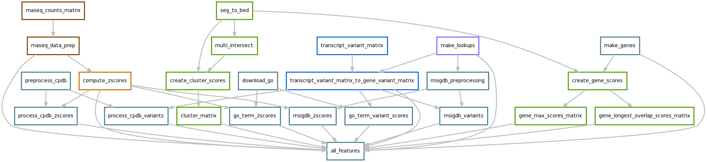
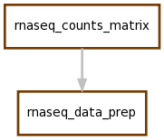
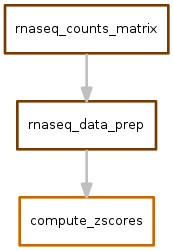
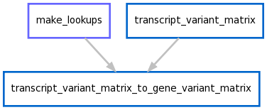
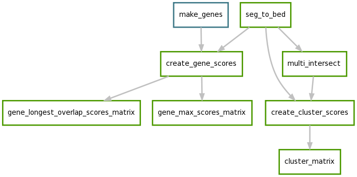
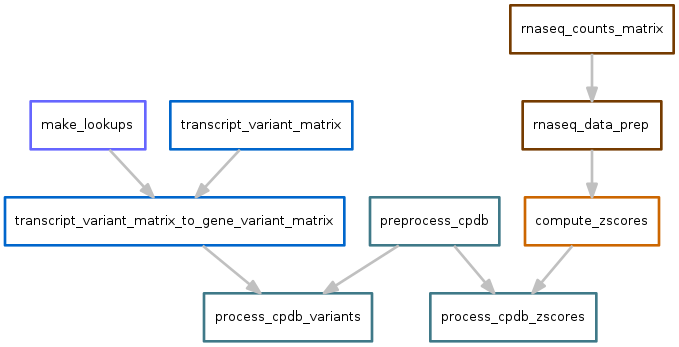
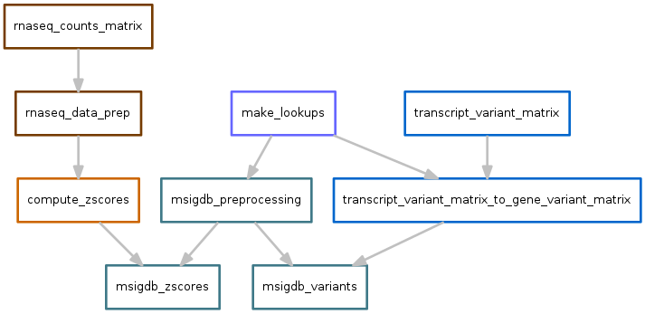

P3 features
===========
While the pipeline is generic enough to support arbitrary numbers of arbitrary
features, here we describe the actual features used. This section can be used
as a starting point for creating custom sets of features for other types of
data.

Each set of features requires a different set of pre-processing steps. To
accommodate this, and to isolate the customization into discrete,
easily-editable components, features are handled by separate workflows. In some
cases, the workflows are interdepedent on each other. Each workflow is expected to
create the output files defined in the ``config.yaml`` file.

Below, each sub-workflow is shown separately as a directed acyclic graph (DAG)
of the tasks performed and the first few lines of the output file (or files)
are shown. To illustrate interdepdencies among workflows, sub-workflows have
been color coded.

.. _all:

``runall.snakefile``

.. _normcounts:

``norm_counts.snakefile``
-------------------------

This workflow starts with `htseq-count` files, one for each sample. They have
the following format:

.. literalinclude:: ../../example_data/raw/rnaseq_expression/LineA_1_counts.csv
    :lines: 1-5

The workflow is the following:

The output file of ``norm_counts.snakefile`` is a table of gene-level
quantile-normalized counts per million (CPM). One row per gene, and one column
per sample:

.. literalinclude:: ../../example_data/filtered/rnaseq_expression/counts_matrix_normalized.csv
    :lines: 1-5

.. _zscores:

``zscores.snakefile``
---------------------
This workflow takes the output of :ref:`normcounts` and converts counts into
zscores. In the absence of matched controls, these zscores are then used as
a proxy for direction and magnitude of differential expression.

Output looks like this:

.. literalinclude:: ../../example_data/filtered/rnaseq_expression/zscores.csv
    :lines: 1-5

.. _variants:

``variants.snakefile``
----------------------
.. todo::

    Need more methods here about how the original data files were processed.

The starting point of the exome variant data are tab-delimited files, one for
each sample, generated by running SnpEff on VCF files, performing filtering
steps to exclude likely germline mutations, and excluding the VCF header:

.. literalinclude:: ../../example_data/raw/exome_variants/LineA_1_exome_variants.txt
    :lines: 1-5

SnpEff reports effects on a per-transcript basis. For integration with other
features that consider genes (i.e., the pathway features), after
collecting samples into a `transcripts x sample` matrix, we aggregate into
a `gene x sample` matrix by summing variants across all transcripts of a gene.

Output of the `gene x sample` matrix looks like this, where values indicate the
total number of variants across a gene in a sample. 

Specifically, since the variants in these files have been pre-filtered to only
contain those with high impact, the value for each gene represents the total
number of rows in the VCF file annotated with transcript IDs (`EFF[*].TRID`
column) belonging to that gene.

.. literalinclude:: ../../example_data/filtered/exome_variants/exome_variants_by_gene.tab 
    :lines: 1-5

.. _cnv:

``cnv.snakefile``
-----------------
The copy number variation (CNV) data starts as files in SEG format for each
sample. For example:

.. literalinclude:: ../../example_data/raw/cnv/LineA_1_cnv.seg
    :lines: 1-5

.. todo::

    Need methods on how the SEG files were created

Since each sample may have a different set of CNVs, the total number of unique
CNVs across all samples must be determined. The `multiinter` program from the
`BEDTools` suite is used to identify a uniform set of segments that can be used
across all samples.

.. todo::

    Add screenshot of bedtools multiinter output

This uniform set of segments is then intersected with the actual segments on
a per-sample basis to obtain per-sample CNV values for each segment. Files
across samples are then aggregated into a single "cluster matrix" file, which
looks like this:

.. literalinclude:: ../../example_data/filtered/cnv/cluster_scores.tab
    :lines: 1-5

Pathways
--------
Several annotation databases are used. These databases have annotations for
each gene in a `gene x annotation` file. However, the features need to be in
a `annotation x samples` file for use with regression methods. Therefore these
pathway workflows use different strategies to calculate a pathway score for
each sample, based on some property or properties of the genes for that pathway
in that sample.

See :ref:`pathway_scores` for more details.

In the pathway workflows below, there are several "flavors" of scores, each of
which are derived from workflows described above. For example, there are scores
derived from zscores, variants, and CNV data.

.. _cpdb:

Consensus pathway database
~~~~~~~~~~~~~~~~~~~~~~~~~~

Scores for each pathway are calculated based on the output of
:ref:`variants` and :ref:`zscores`.

Variants output file:

.. literalinclude:: ../../example_data/filtered/consensus_pathway/cpdb_variants.csv

Zscores output file:

.. literalinclude:: ../../example_data/filtered/consensus_pathway/cpdb_zscores.csv

.. _go:

Gene ontology
~~~~~~~~~~~~~
Scores for each GO term are calculated based on the output of
:ref:`variants` and :ref:`zscores`.

.. image:: images/go_dag.png

Variants output file:

.. literalinclude:: ../../example_data/filtered/go/go_variants.csv

Zscores output file:

.. literalinclude:: ../../example_data/filtered/go/go_zscores.csv

.. _msigdb:

MSIG database
~~~~~~~~~~~~~
Scores for each pathway are calculated based on the output of
:ref:`variants` and :ref:`zscores`.

Variants output file:

.. literalinclude:: ../../example_data/filtered/msigdb/msigdb_variants.csv

Zscores output file:

.. literalinclude:: ../../example_data/filtered/msigdb/msigdb_zscores.csv

